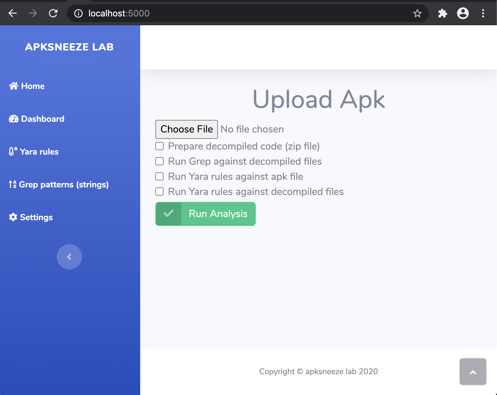
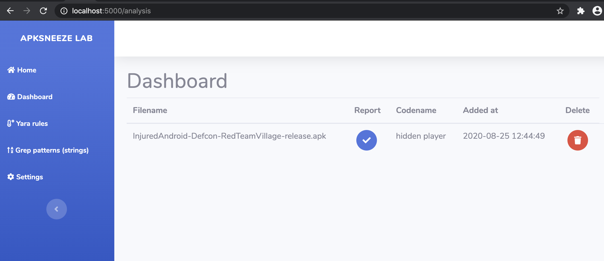
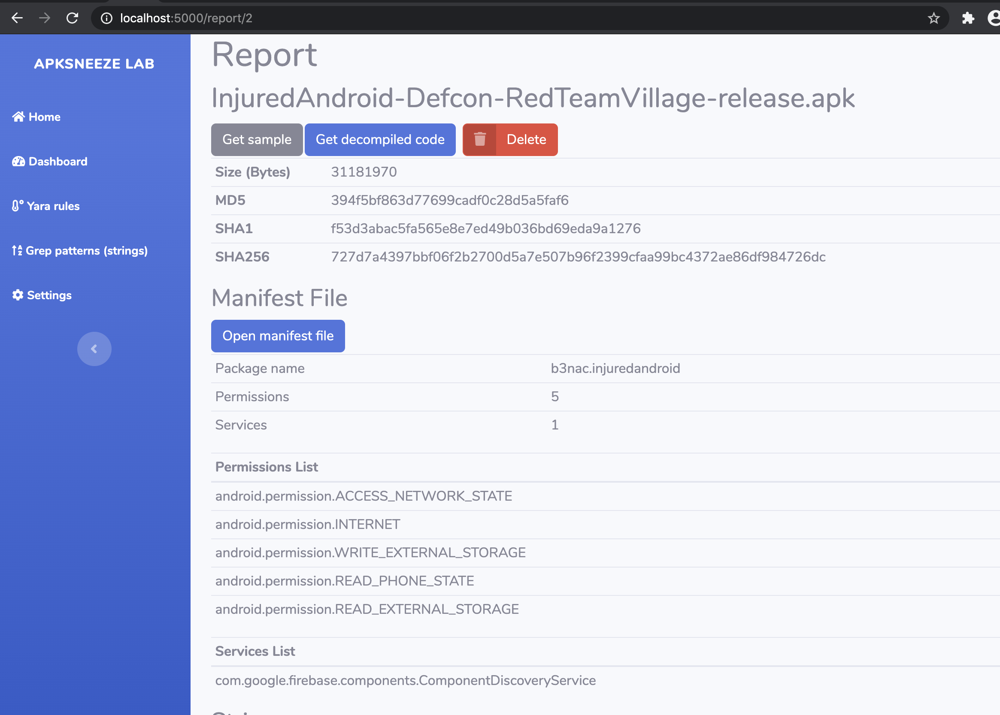
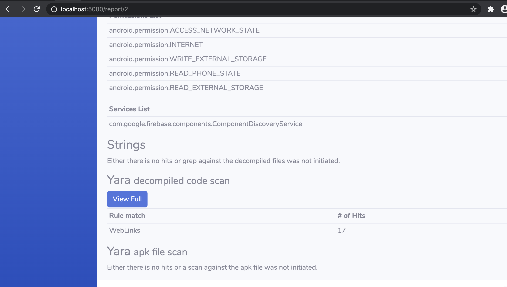
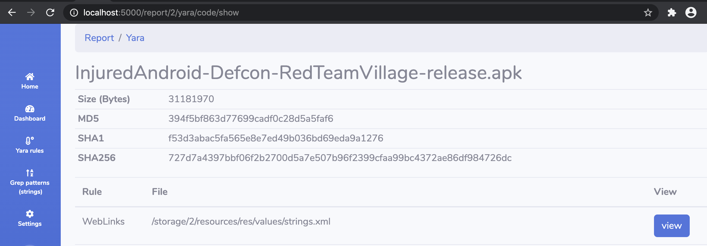
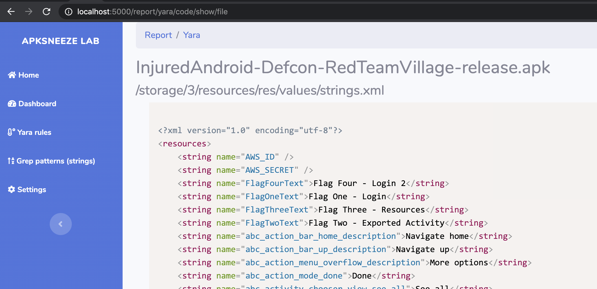
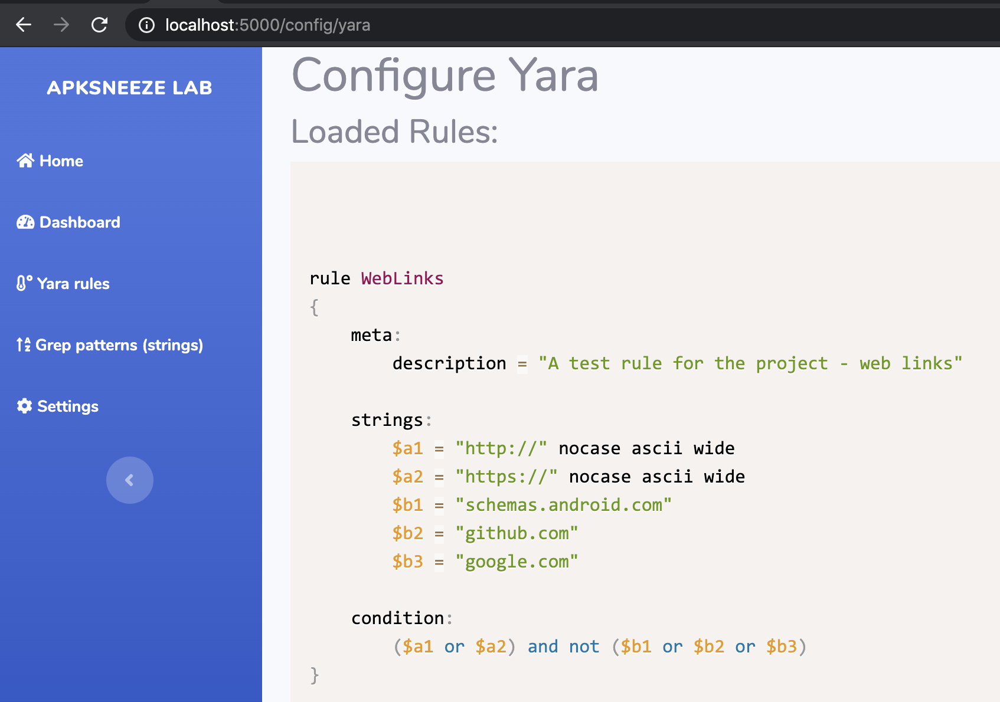
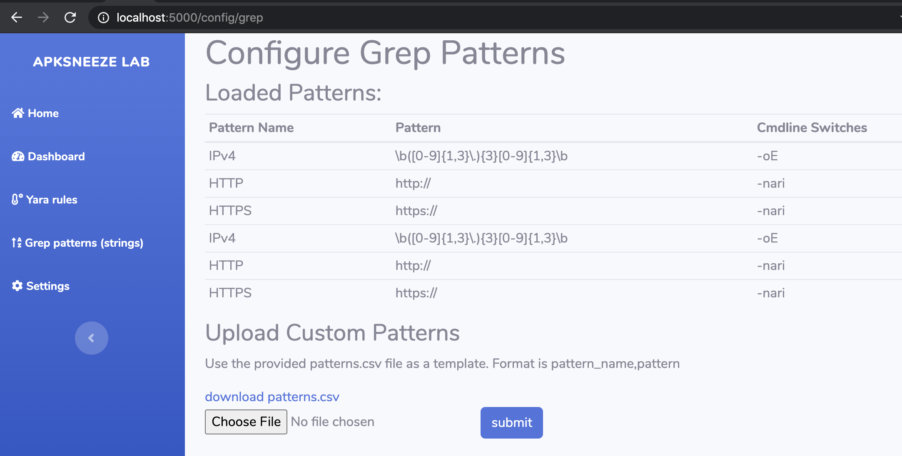

# APKSNEEZE Lab v0.1

Static analysis tool for android apk files.

Current features:
1. Decompile apk files with JADX
2. Zip decompiled files and download them
3. Scan apk file or decompiled code with Yara
4. View in browser specific files that matched a yara rule or download them
4. Grep decompiled files for specific grep patterns
5. Parse/detect permissions and service in manifest files
6. Download manifest files
7. configure grep patterns and yara rules

## Usage

Run project:

`docker-compose -f local.yml`

Or as daemon:

`docker-compose -f local.yml -d`

Then visit: `http://localhost:5000`

Once the docker images are built and the containers are running, two things must be done:

1. Compile yara rules:

`docker-compose -f local.yml exec flask flask apksneeze compile`

2. Seed db (populate grep patterns):

`docker-compose -f local.yml exec flask flask apksneeze seed`

## Modifying Code
You can modify code on the fly since the code volume is mounted  on both the web app and the worker, plus the project is running in debug mode.

## Screenshots
Index page

Dashboard page

Report pages:

Viewing matched yara rules:

View code from file with matched a yara rule:

Yara rules configuration:

Grep patterns configuration:

## Containers
1. Alpine python (web app)
2. Alpine OpenJDK (worker)
3. Redis
4. Postgres

## Disclaimer
I do not recommend running this in production or any corporate environment. This is to be treated as a tool with similar capabilities as a terminal. Example, you can see the way that the grep patterns are being imported and used, it is very dangerous as it can be easily abused. Make sure that you know what you are doing.

Usage of APKSneeze Lab for attacking targets without prior mutual consent is illegal. It is the end user's responsibility to obey all applicable local, state and federal laws. Developers assume no liability and are not responsible for any misuse or damage caused by this program.